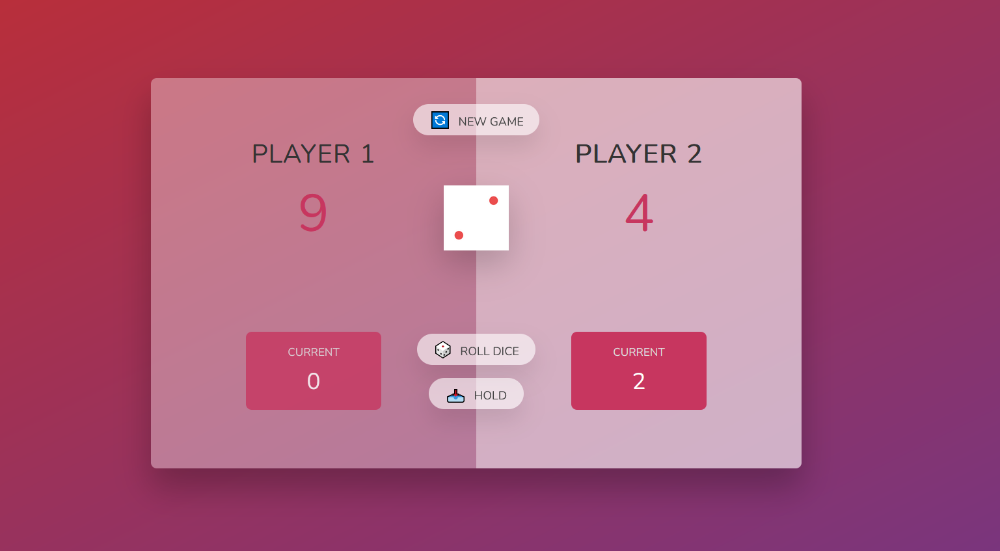

# Pig Game

This is a version of the Pig Game. The goal is to score 100 total points before your opponent. Every time that you roll the dice and get 1 you lost the current score.

## Table of contents

- [Overview](#overview)
  - [The challenge](#the-challenge)
  - [Screenshot](#screenshot)
  - [Links](#links)
- [My process](#my-process)
  - [Built with](#built-with)
  - [What I learned](#what-i-learned)
- [Author](#author)

## Overview

### The challenge

Creating an order summary card where users should be able to see hover states for interactive elements on every screen size.

### Screenshot

### Links

- [Live Site URL](https://piggame-with-js.netlify.app)

## My process

### Built with

- Semantic HTML5 markup
- CSS
- Javascript

### What I learned

Handling the DOM with vanilla Javascript.

## Author

- Frontend Mentor - [@dnewbie25](https://www.frontendmentor.io/profile/dnewbie25)
- DevChallenges - [dnewbie25](https://devchallenges.io/portfolio/dnewbie25)
